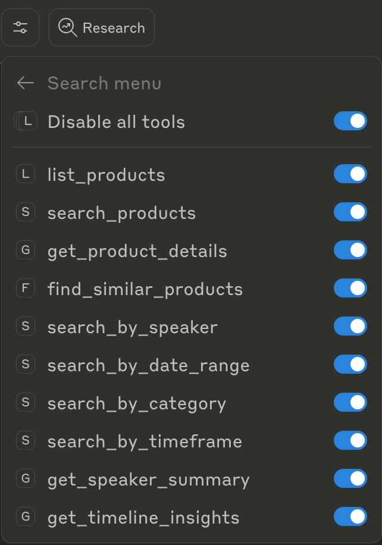
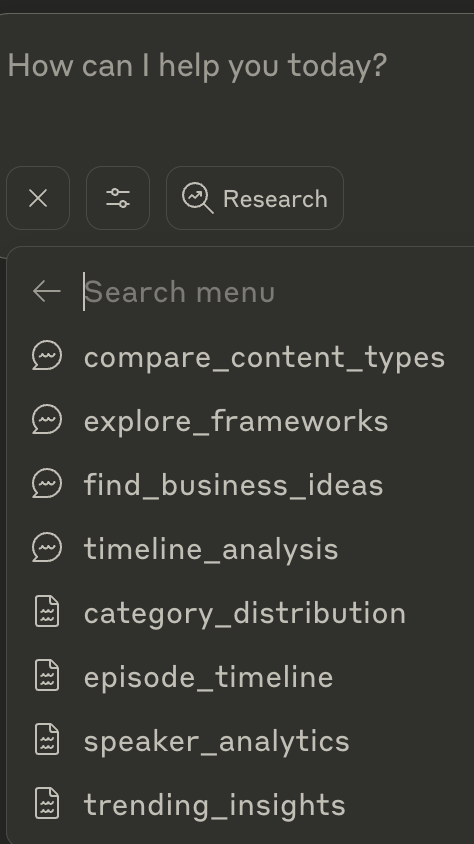
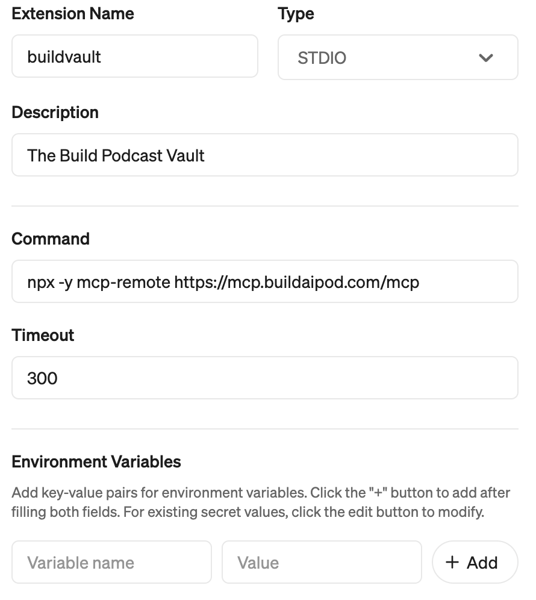
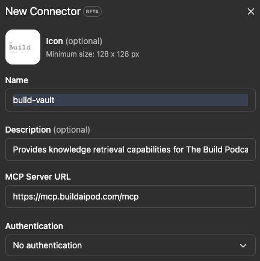
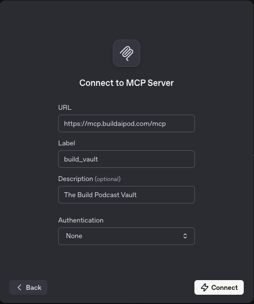

# The Build Vault MCP Server

<div align="left">
  
</div>

## Overview

A **Model Context Protocol (MCP) server** that transforms [The Build Podcast](https://www.youtube.com/@the-build-podcast) into a searchable knowledge base with thousands of AI insights using advanced semantic search. Combines vector similarity with full-text search to help you discover business ideas, frameworks, and product strategies. Access the collective wisdom of builders and entrepreneurs through natural language queries, making podcast knowledge instantly actionable.


## Background

Our MCP Server sources its information from [The Build Vault](https://vault.buildaipod.com/). The Build Vault is an intelligent archive of AI-focused insights, products, ideas and news extracted from The Build Podcast episodes, produced by an AI-driven data processing pipeline:

Core Processing Pipeline
- YouTube Episode Extraction and Audio Download
- AssemblyAI Transcriptions with speaker diarization, sentiment analysis, and auto highlights
- Segment Processing with AI-enhanced titles, topics, and key phrases

LLM Driven Content Extraction
- 150-250 word summaries
- Extract insights across Frameworks, Points of View, Business Ideas, Stories, Quotes, and Products
- Product Extraction: Automatically identifies and tracks product mentions from insights, preparing them for enrichment workflows
- Link Processing: Extracts URLs from YouTube descriptions and enriches them with AI-powered summaries, categorization, and key takeaways

Advanced Search & Discovery
- Vector Embeddings: Generates embeddings for semantic search capabilities
- Hybrid Search: Combines vector similarity search with full-text search


## MCP Version Compatibility

### MCP 2025-11-25 Compliance
- **Protocol Version**: [2025-11-25](https://modelcontextprotocol.io/specification/2025-11-25) (negotiates down to 2025-06-18 / 2025-03-26)
- **Transports**: Streamable HTTP (`/mcp`) + legacy SSE (`/sse`) for remote clients, plus stdio for local/npm
- **Tool execution errors**: input/business errors return `isError: true` with actionable text (not protocol errors), enabling model self-correction
- **Structured output**: list/search tools include `structuredContent` mirrored as JSON text
- **Title Fields**: all tools, resources and prompts include descriptive titles
- **OpenAI Deep Research**: `search` + `fetch` tools compatible with Deep Research Custom Connectors

### Vault Discovery Tools (18 Total)
- **list_products / search_products / get_product_details / find_similar_products**: list and semantically search insights; `find_similar_products` uses real vector similarity
- **search_by_date_range / search_by_category / search_by_timeframe / get_timeline_insights**: filter insights by publish date, category, in-episode timestamp, or chronology
- **list_episodes**: browse podcast episodes
- **search / fetch** (Deep Research): natural-language search and full-content retrieval in `{id, title, text, url}` format
- **list_products_catalog / search_products_catalog / get_catalog_product**: browse and search the curated product catalog
- **search_segments**: semantic search over transcript segments
- **list_episode_links**: enriched links/resources referenced in episodes (Spotlight)
- **insights_by_domain / insights_by_tool_category**: filter by technical domain, difficulty, or tool category

Categories: `frameworks`, `points_of_view`, `business_ideas`, `stories`, `quotes`, `products` (legacy aliases `frameworks_and_exercises` and `stories_and_anecdotes` are still accepted).

### Analytics Resources (4 Total)
- **Trending Insights**: High-confidence insights with "What's Next?" guidance
- **Category Distribution**: Live analytics on content breakdown by category
- **Episode Timeline**: Chronological episode data with insight counts
- **Tech Stack Insights**: Technical domain, tool category and implementation-difficulty trends

### Guided Prompts (4 Total)
- **Find Business Ideas**: Discover business insights and opportunities
- **Explore Frameworks**: Structured exploration of frameworks and exercises
- **Timeline Analysis**: Chronological exploration of topics and themes
- **Compare Content Types**: Compare different categories of insights

### "What's Next?" Guidance
Resources append a plain-text **What's Next?** section with contextual next steps
(category breakdowns, suggested tools, example queries). This is descriptive guidance,
not protocol elicitation — the server does not advertise an elicitation capability.


### OpenAI Deep Research Integration

This server is compatible with OpenAI's Deep Research Custom Connectors. The `search` and `fetch` tools are specifically designed to work with Deep Research models:

- **Search Tool**: Accepts natural language queries (e.g., "insights about AI agents") and returns results in the format `{id, title, text, url}`
- **Fetch Tool**: Retrieves complete content with metadata for deep analysis and citation


## MCP Client Configuration

### Known Client Compatibility:
- Claude Desktop
- Claude Code
- Goose
- OpenAI ChatGPT (chat.openai.com)
- OpenAI Playground

### Claude Desktop
```json
{
  "mcpServers": {
    "build-vault": {
      "command": "npx",
      "args": ["-y", "mcp-remote", "https://mcp.buildaipod.com/mcp"]
    }
  }
}
```
### Claude Code
```
claude mcp add build-vault -s user --transport http https://mcp.buildaipod.com/mcp
```





### Goose AI Extension



### OpenAI ChatGPT (Custom Connectors)



### OpenAI Playground




## Usage Examples

### Discovering AI Products
1. **Browse Categories**: Use `search_by_category` with "products" to browse the products category
2. **Semantic Search**: Try `search_products` with "AI agents" or "LangChain"
3. **Trending Content**: Access `vault://trending_insights` resource for top high-confidence insights
4. **Follow Suggestions**: Look for "What's Next?" sections with intelligent recommendations


## Example Searches

Try these searches to get started:

- "What frameworks exist for prompt engineering?"
- "Business ideas in the healthcare AI space"
- "How are teams using LangChain in production?"
- "Insights about AI safety and alignment"
- "Products for building chatbots"


## Available Tools

| Tool | Name | Description | Parameters |
|------|------|-------------|------------|
| **List Products** | `list_products` | List insights with filtering/pagination | `limit`, `offset`, `episode_id` |
| **Search Products** | `search_products` | Semantic search across insights | `query`, `limit`, `similarity_threshold` |
| **Get Product Details** | `get_product_details` | Get a specific insight by ID | `product_id` |
| **Find Similar Products** | `find_similar_products` | Vector-similar insights to a given one | `product_id`, `limit`, `similarity_threshold` |
| **Search by Date Range** | `search_by_date_range` | Insights from episodes in a date range | `start_date`, `end_date`, `limit` |
| **Search by Category** | `search_by_category` | Filter insights by category | `category`, `limit` |
| **Search by Timeframe** | `search_by_timeframe` | Insights within episode timestamps | `start_timestamp`, `end_timestamp`, `episode_id`, `limit` |
| **Get Timeline Insights** | `get_timeline_insights` | Chronologically ordered insights | `episode_id`, `limit` |
| **List Episodes** | `list_episodes` | Browse podcast episodes | `limit`, `order` |
| **Search** | `search` | Deep Research search (`{id,title,text,url}`) | `query` |
| **Fetch** | `fetch` | Deep Research full content + metadata | `id` |
| **List Products Catalog** | `list_products_catalog` | Browse the curated product catalog | `category`, `limit`, `page` |
| **Search Products Catalog** | `search_products_catalog` | Search the product catalog | `query`, `limit`, `similarity_threshold` |
| **Get Catalog Product** | `get_catalog_product` | Get a catalog product by ID | `product_id` |
| **Search Segments** | `search_segments` | Semantic search over transcript segments | `query`, `limit`, `similarity_threshold` |
| **List Episode Links** | `list_episode_links` | Enriched links/resources (Spotlight) | `category`, `limit` |
| **Insights by Domain** | `insights_by_domain` | Filter by technical domain/difficulty | `domain`, `difficulty` |
| **Insights by Tool Category** | `insights_by_tool_category` | Filter by tool category | `tool_category` |

## Available Resources

| Resource | URI | Description |
|----------|-----|-------------|
| **Trending Insights** | `vault://trending_insights` | High-confidence insights with "What's Next?" guidance |
| **Category Distribution** | `vault://category_distribution` | Analytics on content breakdown by category |
| **Episode Timeline** | `vault://episode_timeline` | Chronological episode data with metadata |
| **Tech Stack Insights** | `vault://tech_stack_insights` | Technical domain / tool category / difficulty trends |

## Available Prompts

| Prompt | Name | Description | Arguments |
|--------|------|-------------|-----------|
| **Find Business Ideas** | `find_business_ideas` | Guided workflow to discover business insights and opportunities | `industry` (optional), `focus` (optional) |
| **Explore Frameworks** | `explore_frameworks` | Structured exploration of frameworks and exercises | `domain` (optional), `purpose` (optional) |
| **Timeline Analysis** | `timeline_analysis` | Chronological exploration of topics and themes | `speaker_focus` (optional), `theme` (optional) |
| **Compare Content Types** | `compare_content_types` | Compare different categories of insights and content | `categories` (optional), `criteria` (optional) |


## Architecture

### Key Technical Features
- **Multiple transports**: Streamable HTTP (`/mcp`) + legacy SSE (`/sse`) for remote clients; stdio for local
- **Type Safety**: TypeScript with Zod runtime validation
- **Vector Search**: real semantic similarity over insights, products and transcript segments
- **Health Monitoring**: `GET /health` endpoint
- **Deep Research Compatible**: `search`/`fetch` tools for OpenAI integration


## Data Overview

- **Content**: thousands of AI insights, products, episodes and transcript segments from [vault.buildaipod.com](https://vault.buildaipod.com)
- **Search**: semantic vector search plus full-text and category/date/timeframe filtering
- **Categories**: 6 types (`frameworks`, `points_of_view`, `business_ideas`, `stories`, `quotes`, `products`)


## Version Information

- **Version**: 0.3.0
- **Protocol**: MCP 2025-11-25 (negotiates to 2025-06-18 / 2025-03-26)
- **Transports**: Streamable HTTP (`/mcp`), legacy SSE (`/sse`), stdio

## Testing

- **MCP Central Lab**: Test the server interactively at https://lab.mcpcentral.io/

## MCP Registry

This server is published in the official [Model Context Protocol Registry](https://github.com/modelcontextprotocol/registry). The registry configuration is defined in `server.json`, which specifies:

- **Server Metadata**: Name, description, and repository information
- **Remote Endpoints**: HTTP transport endpoints at `https://mcp.buildaipod.com/mcp` and `https://mcp.demos.build/mcp`
- **Package Distribution**: Available on npm as `build-vault-mcp-server`
- **Client Compatibility**: Supports Claude Desktop, Claude Code, Goose, and OpenAI ChatGPT
- **Feature Declaration**: 18 tools, 4 resources, 4 prompts with semantic search and deep research capabilities

The registry enables automatic discovery and installation of this MCP server across compatible clients.

## Support

- **GitHub Issues**: For bug reports and feature requests
- **Health Check**: `GET /health` endpoint for status monitoring

---

## Working Examples

### Example 1: AI Agent Research for Developers

**Scenario**: A developer wants to research AI agents and autonomous systems to build their own agent framework.

**Tools Used**: search, fetch, search_segments

1. **Initial Search**: Search for "AI agents and autonomous systems"
2. **Get Detailed Content**: Fetch the full content for a specific insight ID
3. **Go Deeper**: Use `search_segments` to find the exact transcript moments

**Expected Results**: Framework discussions, real-world implementations, and expert opinions on agent architecture.

### Example 2: Business Idea Discovery for Entrepreneurs

**Scenario**: An entrepreneur wants to find validated business ideas in the AI space discussed by industry experts.

**Tools Used**: search_by_category, find_similar_products, search_products_catalog

1. **Browse Business Ideas**: Search by category "business_ideas"
2. **Find Similar Concepts**: Find insights similar to interesting results
3. **Map to Tools**: Use `search_products_catalog` to find relevant products

**Expected Results**: SaaS opportunities, AI product concepts, and market validation insights.

### Example 3: Framework Research for Product Managers

**Scenario**: A product manager needs proven frameworks for building AI products and managing development processes.

**Tools Used**: search_by_category, get_timeline_insights, search_by_date_range

1. **Find Frameworks**: Search by category "frameworks"
2. **See Evolution Over Time**: Get timeline insights for 2024
3. **Recent Best Practices**: Search by recent date range

**Expected Results**: Product development methodologies, AI implementation strategies, and team management approaches.
