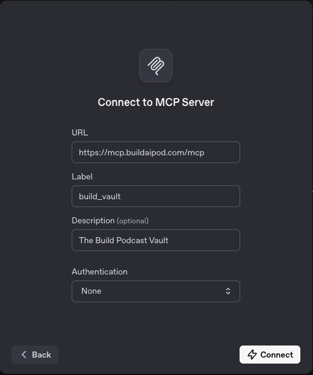

# The Build Vault MCP Server

<div align="left">
  
</div>

## Overview

A **Model Context Protocol (MCP) server** that transforms [The Build Podcast](https://www.youtube.com/@the-build-podcast) into a searchable knowledge base with thousands of AI insights using advanced hybrid search. Combines vector semantic similarity with full-text search to help you discover business ideas, frameworks, and product strategies. Access the collective wisdom of builders and entrepreneurs through natural language queries, making podcast knowledge instantly actionable. 


## Background

Our MCP Server sources it's information from [The Build Vault](https://vault.buildaipod.com/). The Build Vault is an intelligent archive of AI-focused insights, products, ideas and news extracted from The Build Podcast episodes. The backend powers a sophisticated AI-driven data processing pipeline that consists of the following stages:

Core Processing Pipeline
- YouTube Episode Extraction and Audio Download
- AssemblyAI Transcriptions with speaker diarization, sentiment analysis, and auto highlights
- Segment Processing with AI-enhanced titles, topics, and key phrases

LLM Driven Content Extraction 
- 150-250 word summaries
- Extract insights across Frameworks & Exercises, Points of View, Business Ideas, Stories & Anecdotes, Quotes, and Products
- Product Extraction: Automatically identifies and tracks product mentions from insights, preparing them for enrichment workflows
- Link Processing: Extracts URLs from YouTube descriptions and enriches them with AI-powered summaries, categorization, and key takeaways

Advanced Search & Discovery 
- Vector Embeddings: Generates embeddings for semantic search capabilities
- Hybrid Search: Combines vector similarity search with full-text search


## MCP Client Configuration

### Known Client Compatibility:
- Claude Desktop
- Claude Code  
- Goose
- OpenAI ChatGPT (chat.openai.com)
- OpenAI Playground

### Claude Desktop
```json
{
  "mcpServers": {
    "build-vault": {
      "command": "npx",
      "args": ["-y", "mcp-remote", "https://mcp.buildaipod.com/mcp"]
    }
  }
}
```
### Claude Code
```
claude mcp add build-vault -s user --transport http https://mcp.buildaipod.com/mcp
```


### Goose AI Extension


### OpenAI ChatGPT (Custom Connectors)


### OpenAI Playground




## MCP Version Compatability

### MCP 2025-06-18 Compliance
- **Protocol Version**: [2025-06-18](https://modelcontextprotocol.io/introduction) with full specification compliance
- **Structured Output**: Enhanced tools with `outputSchema` and `structuredContent` 
- **Elicitation Support**: Declared capability with intelligent follow-up suggestions
- **Title Fields**: All tools, resources, and prompts include descriptive titles
- **Resource Links**: Cross-referencing between related content
- **Transports**: stdio + Streamable HTTP

### Enhanced Compatability
- **OpenAI Deep Research**: Compatible with OpenAI's Deep Research Custom Connectors

### Vault Discovery Tools (12 Total)
- **List Products**: Browse AI products with filtering and pagination
- **Search Products**: Semantic search using embeddings (3072 dimensions)
- **Product Details**: Comprehensive product information with resource links
- **Find Similar**: Vector similarity search for related products
- **Search by Speaker**: Filter insights by podcast speakers (Tom Spencer, Cameron Rohn)
- **Search by Date Range**: Find products within specific time periods
- **Search by Category**: Filter by 6 content categories (business_ideas, frameworks_and_exercises, products, points_of_view, stories_and_anecdotes, quotes)
-  **Search by Timeframe**: Find insights within episode timestamps
- **Speaker Summary**: Comprehensive speaker statistics and insights
- **Timeline Insights**: Chronologically ordered insights with metadata
- **Search** (Deep Research): Natural language search for AI insights and episodes
- **Fetch** (Deep Research): Get complete content with full context and metadata

### Analytics Resources with Elicitation (4 Total)
- **Trending Insights**: High-confidence insights with smart follow-up suggestions
- **Category Distribution**: Live analytics on content breakdown by category
- **Episode Timeline**: Chronological episode data with insight counts
- **Speaker Analytics**: Real-time speaker statistics and content analysis

### Guided Prompts (4 Total)
- **Find Business Ideas**: Discover business insights and opportunities
- **Explore Frameworks**: Structured exploration of frameworks and exercises
- **Timeline Analysis**: Chronological exploration of topics and themes
- **Compare Content Types**: Compare different categories of insights

### Enhanced Elicitation Features
When accessing resources, the server provides **intelligent follow-up suggestions**:
- **Category Analysis**: "Found 9 product insights, 6 points_of_view insights"
- **Speaker Breakdown**: "Cameron Rohn (11 insights), Tom Spencer (8 insights)"
- **Tool Recommendations**: Specific next-step suggestions with usage examples
- **Semantic Search Guidance**: Query suggestions based on actual content


### OpenAI Deep Research Integration

This server is compatible with OpenAI's Deep Research Custom Connectors. The `search` and `fetch` tools are specifically designed to work with Deep Research models:

- **Search Tool**: Accepts natural language queries (e.g., "insights about AI agents") and returns results in the format `{id, title, text, url}`
- **Fetch Tool**: Retrieves complete content with metadata for deep analysis and citation


## Usage Examples

### Discovering AI Products
1. **Browse Categories**: Use `search_by_category` with "products" to see 334 product insights
2. **Semantic Search**: Try `search_products` with "AI agents" or "LangChain" 
3. **Trending Content**: Access `vault://trending_insights` resource for top 20 high-confidence insights
4. **Follow Suggestions**: Look for "What's Next?" sections with intelligent recommendations


## Example Searches

Try these searches to get started:

- "What frameworks exist for prompt engineering?"
- "Business ideas in the healthcare AI space"
- "What did Tom Spencer say about LangChain?"
- "Insights about AI safety and alignment"
- "Products for building chatbots"


## Available Tools

| Tool | Name | Description | Parameters |
|------|------|-------------|------------|
| **List Products** | `list_products` | Browse AI products with filtering and pagination | `limit`, `offset`, `category`, `approved_only` |
| **Search Products** | `search_products` | Semantic search across all products | `query`, `limit`, `category` |
| **Get Product Details** | `get_product_details` | Get comprehensive information about a specific product | `product_id` |
| **Find Similar Products** | `find_similar_products` | Find products similar to a given one | `product_id`, `limit` |
| **Search by Speaker** | `search_by_speaker` | Filter insights by podcast speaker | `speaker_name`, `limit` |
| **Search by Date Range** | `search_by_date_range` | Find products within date range | `start_date`, `end_date`, `limit` |
| **Search by Category** | `search_by_category` | Filter by content category | `category`, `limit` |
| **Search by Timeframe** | `search_by_timeframe` | Find insights within episode timestamps | `start_time`, `end_time`, `episode_id` |
| **Get Speaker Summary** | `get_speaker_summary` | Get comprehensive speaker statistics | `speaker_name` |
| **Get Timeline Insights** | `get_timeline_insights` | Get chronologically ordered insights | `limit`, `start_date`, `end_date` |
| **Search** | `search` | Natural language search for ChatGPT Connectors | `query` |
| **Fetch** | `fetch` | Get complete content with metadata for ChatGPT Connectors | `id` |

## Available Resources

| Resource | URI | Description |
|----------|-----|-------------|
| **Trending Insights** | `vault://trending_insights` | Most recent and popular insights with engagement metrics |
| **Category Distribution** | `vault://category_distribution` | Analytics on content breakdown by categories |
| **Episode Timeline** | `vault://episode_timeline` | Chronological episode data with duration and metadata |
| **Speaker Analytics** | `vault://speaker_analytics` | Speaker-specific statistics and content breakdown |
| **Discovery Guide** | `vault://guide/discovery` | How to find and evaluate AI products |
| **Product Catalog** | `vault://product_catalog` | Overview of all products with categories and approval status |
| **Technical Domains** | `vault://technical_domains` | Analysis of technical domains and tool categories |
| **Episode-Insights Map** | `vault://episode_insights_map` | Comprehensive mapping of episodes to their insights and products |

## Available Prompts

| Prompt | Name | Description | Arguments |
|--------|------|-------------|-----------|
| **Find Business Ideas** | `find_business_ideas` | Guided workflow to discover business insights and opportunities | `industry` (optional), `focus` (optional) |
| **Explore Frameworks** | `explore_frameworks` | Structured exploration of frameworks and exercises | `domain` (optional), `purpose` (optional) |
| **Timeline Analysis** | `timeline_analysis` | Chronological exploration of topics and themes | `speaker_focus` (optional), `theme` (optional) |
| **Compare Content Types** | `compare_content_types` | Compare different categories of insights and content | `categories` (optional), `criteria` (optional) |


## Architecture

### Key Technical Features
- **Triple Transport Design**: stdio, HTTP, and Cloudflare Workers
- **Type Safety**: TypeScript with Zod runtime validation
- **Vector Search**: Real-time semantic similarity
- **Elicitation**: Intelligent follow-up suggestions based on content analysis
- **Health Monitoring**: Built-in health check endpoints
- **Deep Research Compatible**: Implements search/fetch tools for OpenAI integration


## Data Overview

### Primary Data Source: The Build Vault Database
- **DB Tables**: Index with vector embeddings
- **Content**: Thousands of AI insights from [vault.buildaipod.com](https://vault.buildaipod.com)
- **Categories**: 6 types (business_ideas, frameworks_and_exercises, products, points_of_view)
- **Embeddings**: 3072-dimensional vectors from text-embedding-3-large


## Version Information

- **Version**: 0.2.0
- **Protocol**: MCP 2025-06-18 
- **SDK**: @modelcontextprotocol/sdk 1.16.0
- **Features**: Full specification compliance with elicitation, structured output, resource links, and Deep Research compatibility
- **stdio**: Default MCP transport for direct client integration
- **http**: MCP 2025-06-18 Streamable HTTP with header validation

## Testing

- **MCP Central Lab**: Test the server interactively at https://lab.mcpcentral.io/

## MCP Registry

This server is published in the official [Model Context Protocol Registry](https://github.com/modelcontextprotocol/registry). The registry configuration is defined in `server.json`, which specifies:

- **Server Metadata**: Name, description, and repository information
- **Remote Endpoints**: HTTP transport endpoints at `https://mcp.buildaipod.com/mcp` and `https://mcp.demos.build/mcp`
- **Package Distribution**: Available on npm as `build-vault-mcp-server`
- **Client Compatibility**: Supports Claude Desktop, Claude Code, Goose, and OpenAI ChatGPT
- **Feature Declaration**: 12 tools, 8 resources, 4 prompts with semantic search and deep research capabilities

The registry enables automatic discovery and installation of this MCP server across compatible clients.

## Support

- **GitHub Issues**: For bug reports and feature requests
- **Health Check**: `GET /health` endpoint for status monitoring

---

## Working Examples

### Example 1: AI Agent Research for Developers

**Scenario**: A developer wants to research AI agents and autonomous systems to build their own agent framework.

**Tools Used**: search, fetch, search_by_speaker

1. **Initial Search**: Search for "AI agents and autonomous systems"
2. **Get Detailed Content**: Fetch the full content for a specific insight ID
3. **Find Expert Perspectives**: Search for insights by speaker "Tom Spencer"

**Expected Results**: Framework discussions, real-world implementations, and expert opinions on agent architecture.

### Example 2: Business Idea Discovery for Entrepreneurs

**Scenario**: An entrepreneur wants to find validated business ideas in the AI space discussed by industry experts.

**Tools Used**: search_by_category, find_similar_products, get_speaker_summary

1. **Browse Business Ideas**: Search by category "business_ideas" 
2. **Find Similar Concepts**: Find products similar to interesting results
3. **Expert Analysis**: Get comprehensive summary for speaker "Cameron Rohn"

**Expected Results**: SaaS opportunities, AI product concepts, and market validation insights.

### Example 3: Framework Research for Product Managers

**Scenario**: A product manager needs proven frameworks for building AI products and managing development processes.

**Tools Used**: search_by_category, get_timeline_insights, search_by_date_range

1. **Find Frameworks**: Search by category "frameworks_and_exercises"
2. **See Evolution Over Time**: Get timeline insights for 2024
3. **Recent Best Practices**: Search by recent date range

**Expected Results**: Product development methodologies, AI implementation strategies, and team management approaches.

